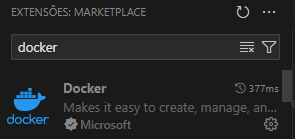
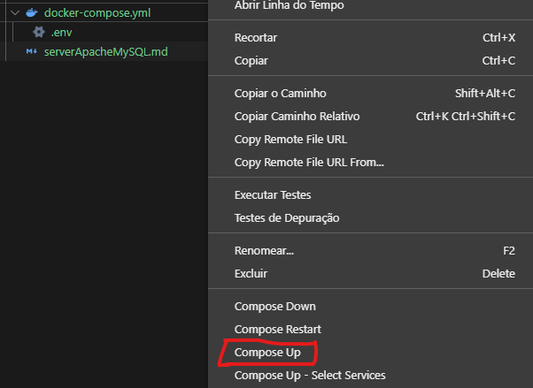

# Server Apache (com suporte a PHP) E Banco MySQL

## Configurando Docker

* Crie um arquivo **docker-compose.yml** e **.env**
* E coloque dentro de cada arquivo
* **docker-compose.yml** com Apache e MySQL

  ```yaml
  version: "3"
  services:
    mysql:
      image: mysql:8.0
      restart: always
      environment:
        - MYSQL_DATABASE=${MYSQL_DATABASE}
        - MYSQL_ROOT_PASSWORD=${MYSQL_PASSWORD}
      ports:
        - "127.0.0.1:${MYSQL_PORT}:3306"
      volumes:
        - mysql:/var/lib/mysql
    apache:
      image: pswerlang/php-apache
      restart: always
      ports:
        - "${APACHE_PORT}:80"
      volumes:
        - ./:/var/www/html
  volumes:
    mysql:
  ```
* **docker-compose.yml** com Apache

  ```yaml
  version: "3"
  services:
    apache:
      image: pswerlang/php-apache
      restart: always
      ports:
        - "${APACHE_PORT}:80"
      volumes:
        - ./:/var/www/html
  ```
* **docker-compose.yml** com MySQL

  ```yaml
  version: "3"
  services:
    mysql:
      image: mysql:8.0
      restart: always
      environment:
        - MYSQL_DATABASE=${MYSQL_DATABASE}
        - MYSQL_ROOT_PASSWORD=${MYSQL_PASSWORD}
      ports:
        - "127.0.0.1:${MYSQL_PORT}:3306"
      volumes:
        - mysql:/var/lib/mysql
  volumes:
    mysql:
  ```
* **.env**

  ```yaml
      MYSQL_DATABASE= # (Seu database)
      MYSQL_PASSWORD= # (Sua senha)
      MYSQL_PORT=  # (Sua porta MySQL)
      APACHE_PORT=  # (Sua porta Apache)
  ```

## Executando o **Docker**

* Baixe o Docker em ***[docker.com](https://www.docker.com)*** e abra
* Baixe a extensão **Docker** no VSCode
  
* Clique com o botão direito no **docker-compose.yml** e clique em **Compose Up**
  
* Espere a configuração do Doker terminar e pronto seu servidor Apache esta no ar em **localhost:(sua porta Apache)/**

## Informações **connetion.php** e **MySQL**

* **connection.php**
  ```php
  <?php

  $host = "mysql";
  $user = "root";
  $password = "(sua senha do MySQL do arquivo .env)";
  $database = "(seu databse do MySQL do arquivo .env)";
  $port = 3306;
  $options = [
      PDO::ATTR_ERRMODE =>
      PDO::ERRMODE_EXCEPTION,
      PDO::ATTR_DEFAULT_FETCH_MODE =>
      PDO::FETCH_ASSOC,
  ];

  $output;


  try {
      $conn = new PDO(
          "mysql:host=$host;port=$port;dbname=$database",
          $user,
          $password,
          $options
      );
      $output = [
          "status" => "Conexao Bem Sucedida",
      ];
      echo json_encode($output);
  } catch (PDOException $e) {
      $output = [
          "status"=> "Conexao Falha :" . $e->getMessage(),
      ];
      echo json_encode($output);
  }

  ```
* **MySQL Workbench**
    * Host : localhost
    * Porta : (sua porta do MySQL do arquivo .env)
    * Username : root
    * Password : (sua senha do MySQL do arquivo .env)
    * Database : (seu database do MySQL do arquivo .env)